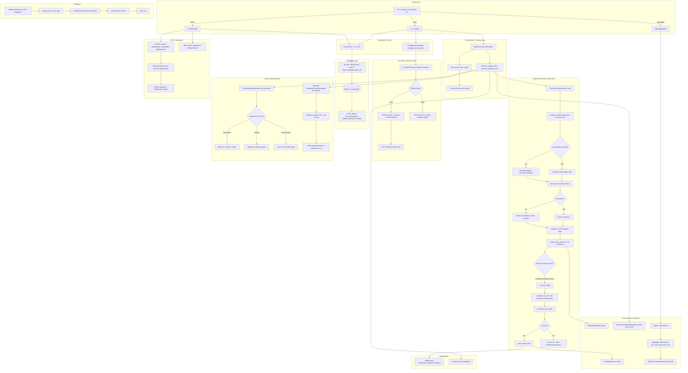

Here’s a **project-specific** version for **`tradingmtq`**, based on your repo tree, with the same “Project Memory” workflow + the added **(D) Dependencies & delivery** section.

---

## Long prompt (TradingMTQ-specific)

```text
You are a senior engineer doing a pre-work codebase analysis for a project named “tradingmtq”.

I will paste files from this repo in chunks (start with entrypoints + bootstrap + config + DB, then core trading/strategies, then ML/LLM/backtest, then API/UI/integrations).
Your goal is to build a reusable “Project Memory” summary so we can safely implement changes.

Repo map (context, don’t assume behavior until you see code):
- src/                   (main source code root)
  - main.py              (primary entrypoint)
  - bot.py               (trading bot core orchestration)
  - config_manager.py    (configuration management singleton)
  - exceptions.py        (custom exception classes)
  - cli/                 (CLI entrypoints, commands, args validation)
  - api/                 (REST/Web API server, routes, request/response models)
  - config/              (settings loader, env/files precedence, defaults)
  - database/            (DB engine/session/repositories; Alembic is in /alembic)
  - connectors/          (MetaTrader / broker / exchange connectors, adapters)
  - trading/             (order execution, position mgmt, risk mgmt, event loop)
  - strategies/          (strategy logic, signal generation, decision rules)
  - indicators/          (TA indicators, feature builders)
  - backtest/            (historical simulation, fill models, metrics)
  - optimization/        (parameter sweeps, tuning, experimentation)
  - ml/                  (ML models, training/inference, feature engineering)
  - llm/                 (LLM integration, prompts/agents, sentiment analysis)
  - analytics/           (analytics utilities, dashboards/insights)
  - analysis/            (market/trade analysis tools)
  - notifications/       (alerts: email/telegram/webhooks/etc.)
  - reports/             (report generation, exports)
  - services/            (service layer / orchestration / business workflows)
  - utils/               (logging, helpers, shared tooling)
  - workers/             (background workers, scheduled tasks)
- alembic/               (migrations, schema evolution)
- config/                (YAML config files: currencies, accounts, MT5, email)
- dashboard/             (static dashboard assets: HTML/CSS/JS)
- data/                  (raw/processed/models datasets)
  - models/              (trained ML models, model artifacts)
  - processed/           (processed trading data)
  - raw/                 (raw market data)
- deploy/                (windows/macos packaging, scripts)
  - macos/               (macOS deployment scripts/packages)
  - windows/             (Windows deployment scripts/packages)
- docs/                  (design/architecture/phases/guides + API docs)
- scripts/               (maintenance, tooling, run helpers)
- tests/                 (unit/integration tests)

Tasks (produce outputs in this order):
1) TL;DR (5–10 bullets): what tradingmtq does end-to-end (user + system view).
2) Architecture / flow diagram (Mermaid preferred; ASCII ok):
   CLI/API/UI → config bootstrap → DB/init → connectors → strategy engine →
   trading/execution → persistence → reporting/notifications → shutdown.
3) Entrypoints & runtime:
   - Identify exact entry files/modules (CLI main, API server main, workers/schedulers).
   - Explain how each mode runs: CLI commands, API startup, background jobs.
4) Key abstractions & responsibilities:
   - Core classes/functions (Trader/Engine/Executor/Strategy/Connector/Repository/etc.)
   - How data flows between them (signals → orders → executions → positions → P&L).
5) Configuration model:
   - Where config comes from (env/files/CLI flags/secrets)
   - Precedence rules and default profiles (paper/live/backtest, aggressive/conservative, etc.)
6) (D) Dependencies & delivery (build/deploy/CI):
   - Packaging (pyproject/setup, requirements, lockfiles)
   - Runtime deps (DB, broker terminal, API keys, GPU/ML libs if relevant)
   - Deployment artifacts (deploy/windows, deploy/macos, Dockerfile if exists)
   - CI/CD and release/versioning (if present)
   - Local dev workflow: run, test, lint, migrations, dashboard/dev server
7) Data & results pipeline:
   - What inputs exist (market data, account state, configs)
   - What outputs exist (orders, trades, positions, reports, alerts, stored metrics)
   - Backtest outputs vs live outputs (differences, assumptions)
8) Error handling & observability:
   - Logging strategy, metrics/tracing, retries/timeouts, circuit breakers
   - Failure modes (connector disconnects, order rejects, DB errors, partial fills)
9) Extension points (step-by-step, concrete):
   - Add a new strategy
   - Add a new connector/broker adapter
   - Add a new indicator/feature
   - Add a new notification channel
   - Add a new config option that affects runtime behavior end-to-end
10) Hotspots & risks:
   - Tight coupling, global state, hidden IO, concurrency assumptions,
     risk mgmt gaps, money-safety issues, testing gaps, security footguns.
11) End with a Project Memory block (250–500 words) I can paste into future chats.

Rules:
- For every important claim, cite “file path + symbol name” (function/class).
- If something is missing, list assumptions + what to verify next (don’t stall).
- Ignore generated artifacts (__pycache__, htmlcov, egg-info, venv, logs output files).
- Be concise, bullet-heavy, and implementation-oriented.

Start by telling me the exact first 6–10 files you want to read.
Prioritize:
- CLI/API entrypoints
- config loader + defaults
- database init + Alembic env
- trading engine/executor core loop
- connector base + one concrete connector
Then begin analysis as soon as I paste them.
```

---

## Short prompt (TradingMTQ-specific)

```text
Analyze the code I paste from “tradingmtq” and produce a reusable Project Memory summary.

Output in this order:
1) What it is / does (5–8 bullets).
2) Execution flow (Mermaid/ASCII): CLI/API/UI → config → DB/init → connectors → strategies → trading/execution → persistence → reports/notifications.
3) Key components & responsibilities:
   - src/main.py, src/bot.py (core entry/orchestration)
   - src/cli/ (CLI commands)
   - src/api/ (web API server)
   - src/config/, config/ (configuration management)
   - src/database/ (DB layer, repositories)
   - src/connectors/ (broker/MT5 integrations)
   - src/trading/ (order execution, position management)
   - src/strategies/ (trading strategies)
   - src/indicators/ (technical indicators)
   - src/backtest/ (backtesting engine)
   - src/optimization/ (parameter optimization)
   - src/ml/, src/llm/ (AI/ML integrations)
   - src/analytics/, src/analysis/ (analytics tools)
   - src/notifications/ (alerting)
   - src/reports/ (reporting)
   - src/services/ (service orchestration)
   - src/utils/ (utilities)
   - src/workers/ (background workers)
   - alembic/ (database migrations)
   - dashboard/ (web UI)
   - data/ (data storage: raw, processed, models)
   - deploy/ (deployment packages)
4) Entrypoints & runtime: how it starts, modes (live/paper/backtest), CLI args/env/config precedence.
5) (D) Dependencies & delivery: packaging, runtime deps (DB/broker), deploy artifacts, CI/CD (if any), local dev workflow.
6) Results pipeline: trades/positions/P&L, reports, alerts; backtest vs live differences.
7) Extension points: add strategy + connector + indicator + notification channel (step-by-step).
8) Hotspots/risks: coupling, error handling, concurrency, money-safety, testing gaps.
9) End with a Project Memory block (250–500 words).

Rules: cite file path + symbol name for each major claim; list assumptions; ignore __pycache__/venv/htmlcov/egg-info.
Start by telling me the first 6–10 files you want me to paste, then begin analysis immediately.
```

---

### Suggested “first 6–10 files” to paste (so we start strong)

If these exist, they’re usually the best starting set:

1. `pyproject.toml` **or** `setup.py` **or** `requirements.txt` (packaging/deps)
2. `src/cli/*` (the main CLI entrypoint file)
3. `src/api/*` (API server entrypoint, routes registration)
4. `src/config/*` (settings loader + defaults)
5. `src/database/*` (engine/session init + repositories)
6. `alembic/env.py` (migration wiring)
7. `src/trading/*` (engine/executor main loop)
8. `src/connectors/*` (base connector + one concrete broker/MT connector)
9. `src/strategies/*` (base strategy + one concrete strategy)
10. `src/utils/logging*` (logging/observability setup)

If you paste those, I can generate the first “Project Memory” pass immediately.
###

